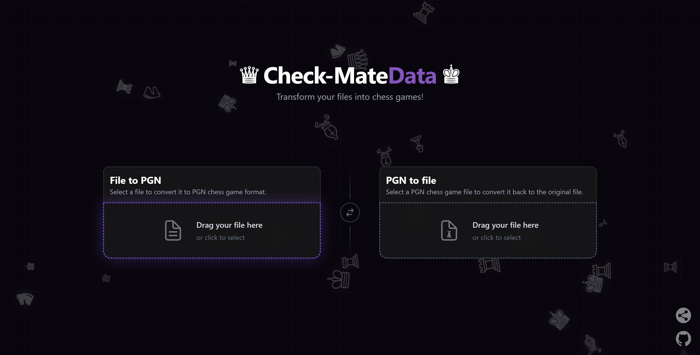
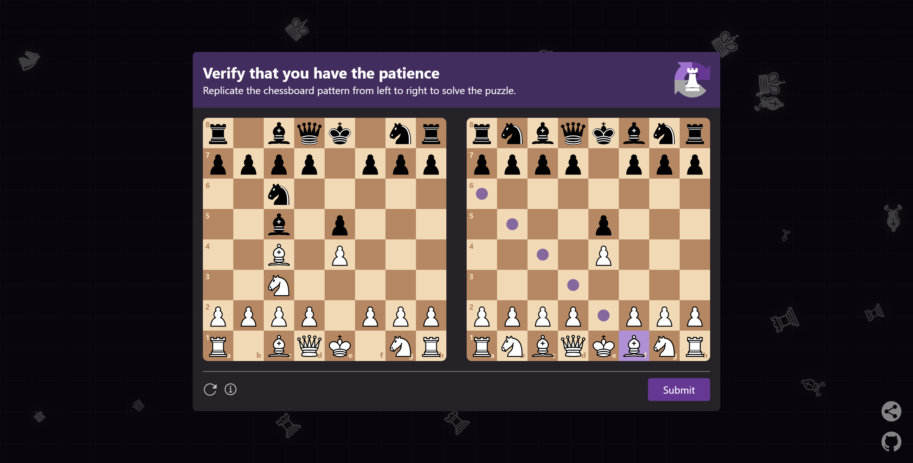
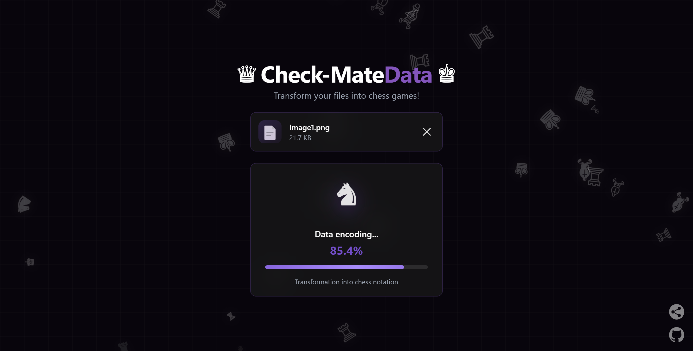

<h1 align="center">Check-MateData</h1>

<a id="readme-top"></a>

<p align="center">
    
    
    
    
    
</p>

<!-- Web tool to encrypt, compress, and convert files into chess games, then restore the original file from a PGN. -->

Check-MateData is a web tool that encrypts, compresses, and transforms files into chess games, then restores files from those games. The app runs entirely in the browser and uses Web Workers to handle heavy tasks without blocking the UI.

<div align="center">
    <h3>
        <a href="https://CapyBlaze.github.io/Check-MateData/" target="_blank">
        👉 Live Demo 👈
        </a>
    </h3>
</div>

<br />

<details>
    <summary>🗂️ Table of Contents</summary>
    <ol>
        <li>
            <a href="#🔎-overview">🔎 Overview</a>
        </li>
        <li>
            <a href="#📸-screenshots">📸 Screenshots</a>
        </li>
        <li>
            <a href="#🚀-getting-started">🚀 Getting Started</a>
        </li>
        <li>
            <a href="#🛠️-architecture-and-tech-stack">🛠️ Architecture and Tech Stack</a>
        </li>
        <li>
            <a href="#📘-encodingdecoding-documentation">📘 Encoding/Decoding Documentation</a>
        </li>
        <li>
            <a href="#🤝-contributing">🤝 Contributing</a>
        </li>
        <li>
            <a href="#📝-license">📝 License</a>
        </li>
        <li>
            <a href="#👤-author">👤 Author</a>
        </li>
    </ol>
</details>

---

## 🔎 Overview

The workflow is simple: you import a file, the app encrypts it, then converts it into a sequence of valid chess moves (PGN format). Recovery does the opposite: from a PGN file, it reconstructs the original bitstream and decrypts it.

### Features

- Client-side encryption and decryption.
- Encoding into chess games (PGN).
- Decoding from PGN back to the original file.
- Async processing via Web Workers.

<p align="right">(<a href="#readme-top">back to top</a>)</p>

## 📸 Screenshots

<table>
    <tr>
        <td>
            
        </td>
        <td>
            
        </td>
    </tr>
    <tr>
        <td>
            
        </td>
        <td>
            
        </td>
    </tr>
</table>

<p align="right">(<a href="#readme-top">back to top</a>)</p>

## 🚀 Getting Started

### Prerequisites

- Node.js (v24 or higher)
- npm, yarn or pnpm

### Installation

1. Clone the repository:

    ```bash
    git clone https://github.com/CapyBlaze/Check-MateData.git
    cd Check-MateData
    ```

2. Install dependencies:

    ```bash
    npm install
    ```

3. Start the development server:

    ```bash
    npm run dev
    ```

4. Open your browser and navigate to `http://localhost:5173`

<p align="right">(<a href="#readme-top">back to top</a>)</p>

## 🛠️ Architecture and Tech Stack

### Architecture

- **Main UI** : [src/App.tsx](src/App.tsx)
- **Components** : [src/Components](src/Components)
- **Encryption/processing services** : [src/Services](src/Services)
- **Binary utilities** : [src/Utils](src/Utils)
- **Web Workers** : [src/worker](src/worker)

### Tech Stack

- **React 19** - UI framework
- **TypeScript** - Type safety
- **Chess.js** - Chess rules engine
- **Vite** - Build tool
- **Tailwind CSS** - Styling

<p align="right">(<a href="#readme-top">back to top</a>)</p>

## 📘 Encoding/Decoding Documentation

This section precisely describes the protocol implemented by [src/Services/encryptFile.ts](src/Services/encryptFile.ts) and [src/Services/decryptFile.ts](src/Services/decryptFile.ts).

### 1) Input and data preparation

- The file is read into a `Uint8Array` and converted to a continuous binary string (8 bits per byte, left-padded).
- No compression or encryption is applied in the current implementation.

### 2) Encoding bits -> chess moves (PGN)

The encoder transforms the bitstream into a sequence of legal chess moves, following these rules:

1. Initialize a standard chessboard (initial position).

2. List the legal moves for the current position.

3. If the list is empty, force the end of the game (flag `endGame`).
     - Otherwise, if there is only one legal move, play it directly without consuming bits, because there is no choice and thus no way to distinguish 0 from 1.
     - Otherwise, compute `k = floor(log2(number_of_legal_moves))`, which represents the number of bits to read to pick a move among the available options.

4. Read `k` bits from the stream and convert them into index `i`.

5. Play the move `movesList[i]`.

6. Repeat until the bitstream is exhausted.

When a game ends (or is forced), a PGN is finalized and a new game starts:

- PGN headers set: Event, Site, Date, White, Black, Round, Result.
- Result values used: `1-0`, `0-1`, `1/2-1/2`, or `*`.
- Each PGN is appended to an array, then the board is reset.

#### Output format

- Encoding output: an array of PGN strings (one game per element).
- Each PGN contains the move list representing the bitstream.

### 3) Decoding chess moves -> bits

Decoding does the reverse, strictly following the same rules:

1. Read one or more PGN files.
2. Split games with the separator `\n+(?=\[Event ")`.
3. For each game, load the PGN and replay moves one by one.
4. Before each move, list legal moves for the current position.
5. If `n > 1`, compute `k = floor(log2(n))` and find the index `i` of the played move.
6. If `i` is valid and `i < 2^k`, convert `i` to binary on `k` bits and append them to the stream.
7. Repeat until the end of the game.

#### File reconstruction

- The reconstructed bits are converted to a `Uint8Array`.
- The final file is created using the original name, but without the original extension and without the prefix before the first `_`.
- Example: `001_photo.png.pgn` -> `photo.png`.
- If no name can be derived, the default name is `decrypted_file`.

### 4) Exposed progress info

The UI can display metrics based on:

- Number of generated games.
- Number of moves played.
- Percentage progress during encoding and decoding.

These metrics are returned through the `onProgress` callbacks in both services.

### 5) Security and limits

- Encryption is handled client-side; no data is sent.
- PGN files can become large for big inputs, which impacts performance, so there is a practical file size limit (50KB).

<p align="right">(<a href="#readme-top">back to top</a>)</p>

## 🤝 Contributing

Contributions are welcome! Feel free to open issues or submit pull requests.

1. Fork the repository
2. Create your feature branch (`git checkout -b feature/AmazingFeature`)
3. Commit your changes (`git commit -m 'Add some AmazingFeature'`)
4. Push to the branch (`git push origin feature/AmazingFeature`)
5. Open a Pull Request

<p align="right">(<a href="#readme-top">back to top</a>)</p>

## 📝 License

This project is licensed under the MIT License - see the [LICENSE](LICENSE) file for details.

<p align="right">(<a href="#readme-top">back to top</a>)</p>

## 👤 Author

### Code

- GitHub: [@CapyBlaze](https://github.com/CapyBlaze)

### Design

- GitHub: [@CapyBlaze](https://github.com/CapyBlaze)

<p align="right">(<a href="#readme-top">back to top</a>)</p>

---

Made with ❤️ by [Capy Blaze](https://github.com/CapyBlaze)
